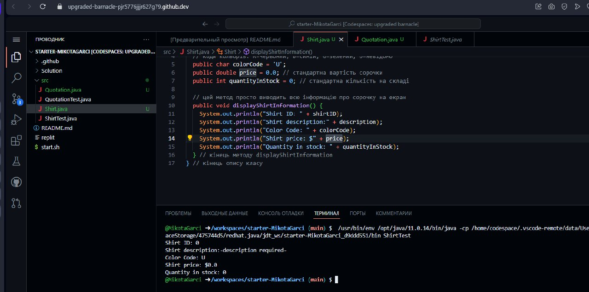
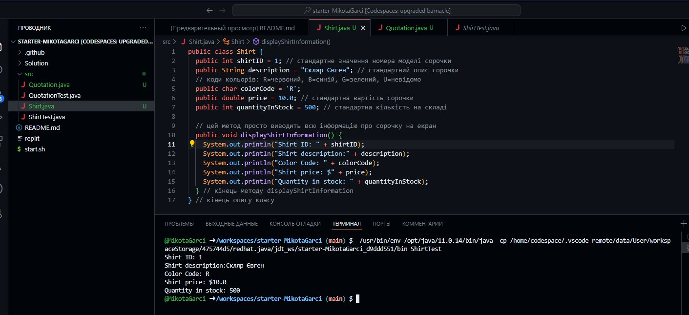

# Скляр Євген 


### Task 1.1 - ShirtTest ↓ 

```Java
public class ShirtTest {

    public static void main(String args[]) {
        Shirt myShirt = new Shirt();
        myShirt.displayShirtInformation();
    }
}
```



### Task 1.1 - Shirt ↓ 
```Java
public class Shirt {
  public int shirtID = 1;
  public String description = "Скляр Євген";
  // Кольори: red, blue, green, unset
  public String colorCode = "R";
  public double price = 10.0;
  public int quantityInStock = 500;

  public void displayShirtInformation() {
      System.out.println("Shirt ID: " + shirtID);
      System.out.println("Shirt description: " + description);
      System.out.println("Color Code: " + getColorString());
      System.out.println("Shirt price: $" + price);
      System.out.println("Quantity in stock: " + quantityInStock);
  }

  private String getColorString() {
      // Перевіряємо значення colorCode і повертаємо відповідний рядок
      switch (colorCode) {
          case "R":
              return "red";
          case "B":
              return "blue";
          case "G":
              return "green";
          default:
              return "unset";
      }
  }
}

```



