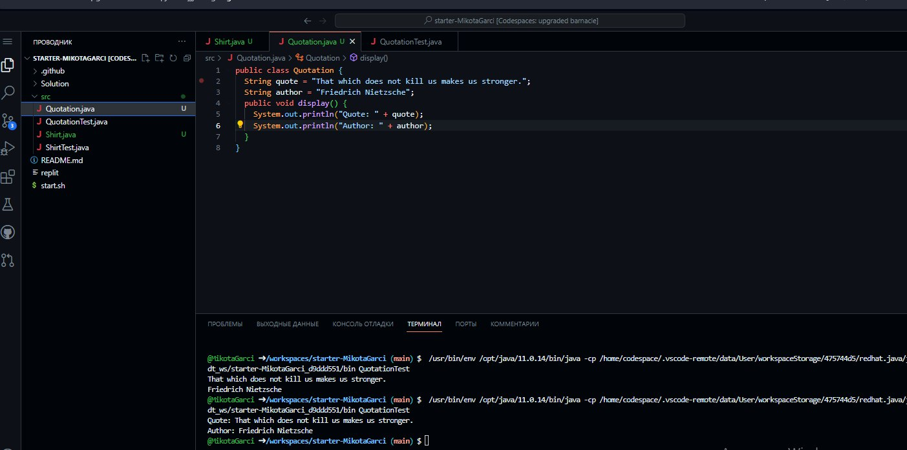

# Скляр Євген 

### Task 2.1 - QuotationTest ↓ 

```Java
public class QuotationTest {
    public static void main(String args[]) {
        Quotation myQuotation = new Quotation();
        myQuotation.display();
    }
}
```
### Task 2.2 - Quotation ↓ 

```Java

public class Quotation {
  String quote = "That which does not kill us makes us stronger.";
  String author = "Friedrich Nietzsche";
  public void display() {
    System.out.println("Quote: " + quote);
    System.out.println("Author: " + author);
  }
}
```



>That which does not kill us makes us stronger.

*Author: Friedrich Nietzsche*